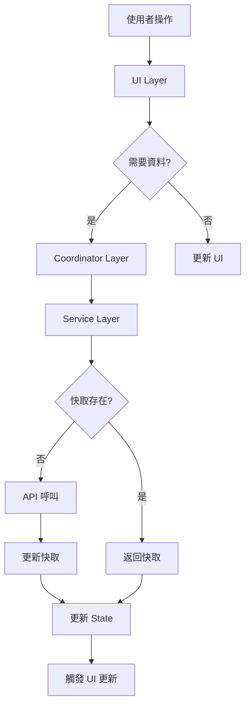
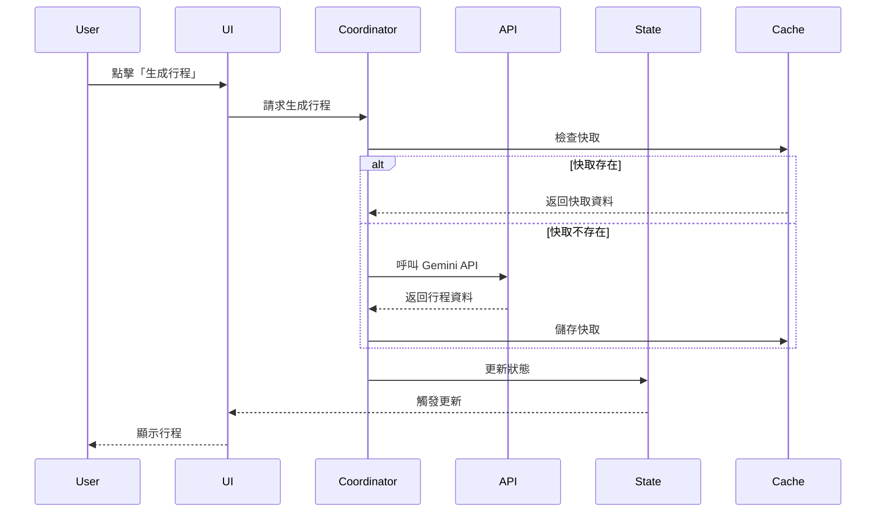
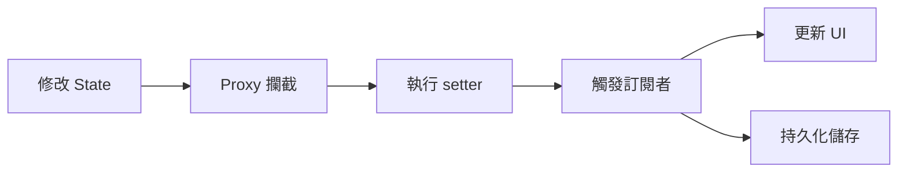

# 架構文檔

本文檔詳細說明 AI 台灣旅遊指南的系統架構、設計模式和模組組織。

---

## 目錄

- [系統概覽](#系統概覽)
- [架構設計](#架構設計)
- [模組結構](#模組結構)
- [資料流](#資料流)
- [狀態管理](#狀態管理)
- [設計模式](#設計模式)
- [效能優化](#效能優化)

---

## 系統概覽

### 技術棧

- **前端框架**: Vanilla JavaScript (ES6+)
- **模組系統**: ES6 Modules
- **地圖**: Leaflet.js
- **PDF 生成**: jsPDF + html2canvas
- **AI**: Google Gemini API
- **樣式**: CSS3 (無框架)

### 核心特性

- ✅ 模組化架構
- ✅ 響應式狀態管理
- ✅ 多層快取策略
- ✅ 智能重試機制
- ✅ 離線備援支援
- ✅ PWA 就緒

---

## 架構設計

### 分層架構

```
┌─────────────────────────────────────────┐
│           Presentation Layer            │
│         (UI Components & Views)         │
├─────────────────────────────────────────┤
│          Coordination Layer             │
│      (Business Logic Coordinators)      │
├─────────────────────────────────────────┤
│            Service Layer                │
│    (API Services & Data Processing)     │
├─────────────────────────────────────────┤
│             Core Layer                  │
│     (State Management & Utilities)      │
└─────────────────────────────────────────┘
```

### 層級說明

#### 1. Presentation Layer (表現層)
- **職責**: UI 渲染、使用者互動
- **主要檔案**: `ui.js`, `improve-itinerary-ui.js`, `version-history-ui.js`
- **特點**: 
  - 純粹的 UI 邏輯
  - 不直接呼叫 API
  - 透過事件與其他層溝通

#### 2. Coordination Layer (協調層)
- **職責**: 協調多個服務、處理複雜業務邏輯
- **主要檔案**: `coordinators/itinerary-coordinator.js`
- **特點**:
  - 編排多個服務呼叫
  - 處理跨模組的業務流程
  - 錯誤處理與恢復

#### 3. Service Layer (服務層)
- **職責**: API 呼叫、資料處理
- **主要檔案**: `api.js`, `services/`, `itinerary.js`
- **特點**:
  - 封裝 API 呼叫
  - 資料轉換與驗證
  - 快取管理

#### 4. Core Layer (核心層)
- **職責**: 狀態管理、工具函數
- **主要檔案**: `state.js`, `config.js`, `utils/`
- **特點**:
  - 全域狀態管理
  - 通用工具函數
  - 配置管理

---

## 模組結構

### 目錄組織

```
js/
├── main.js                          # 應用程式入口
├── config.js                        # 配置管理
├── state.js                         # 狀態管理
├── api.js                           # API 呼叫
├── ui.js                            # UI 主邏輯
├── itinerary.js                     # 行程邏輯
│
├── coordinators/                    # 協調器
│   └── itinerary-coordinator.js     # 行程協調器
│
├── core/                            # 核心功能
│   ├── event-bus.js                 # 事件匯流排
│   └── logger.js                    # 日誌系統
│
├── services/                        # 服務層
│   ├── weather-service.js           # 天氣服務
│   ├── map-service.js               # 地圖服務
│   ├── export-service.js            # 匯出服務
│   └── i18n-service.js              # 國際化服務
│
├── utils/                           # 工具函數
│   ├── date-utils.js                # 日期工具
│   ├── format-utils.js              # 格式化工具
│   ├── security.js                  # 安全工具
│   ├── dom-utils.js                 # DOM 工具
│   └── validation.js                # 驗證工具
│
├── mapProviders/                    # 地圖提供者
│   └── leaflet-provider.js          # Leaflet 實作
│
├── shared/                          # 共享模組
│   └── (shared utilities)
│
├── cache-manager.js                 # 快取管理器
├── api-retry-handler.js             # API 重試處理
├── lazy-loader.js                   # 延遲載入
├── version-history.js               # 版本歷史
├── smart-trip-planner.js            # 智能規劃器
└── travel-journal-generator.js      # 日記生成器
```

### 核心模組詳解

#### `main.js` - 應用程式入口

```javascript
// 職責:
// 1. 初始化應用程式
// 2. 設定事件監聽
// 3. 載入必要模組
// 4. 處理骨架屏

import { initializeApp, setupEventListeners } from './ui.js';
import './init-modules.js';
import './state-expose.js';

function init() {
    initializeApp();
    setupEventListeners();
    // ... 其他初始化邏輯
}
```

#### `state.js` - 狀態管理

```javascript
// 職責:
// 1. 全域狀態儲存
// 2. 響應式狀態更新
// 3. 狀態持久化

export const appState = new Proxy({
    selectedDestinations: [],
    currentItinerary: null,
    apiKeys: {},
    // ... 其他狀態
}, {
    set(target, property, value) {
        target[property] = value;
        // 觸發相關更新
        return true;
    }
});
```

#### `api.js` - API 管理

```javascript
// 職責:
// 1. 統一 API 呼叫介面
// 2. 錯誤處理
// 3. 重試邏輯
// 4. 快取整合

export async function callGeminiAPI(prompt) {
    // 驗證 API Key
    // 建立請求
    // 處理回應
    // 錯誤處理
}
```

#### `ui.js` - UI 邏輯

```javascript
// 職責:
// 1. DOM 操作
// 2. 事件處理
// 3. UI 更新
// 4. 使用者互動

export function renderDestinationCards(destinations) {
    // 渲染景點卡片
}

export function setupEventListeners() {
    // 設定事件監聽器
}
```

#### `config.js` - 配置管理

```javascript
// 職責:
// 1. 集中管理配置
// 2. 環境變數
// 3. 功能開關

export const CONFIG = {
    CACHE: { /* 快取配置 */ },
    API: { /* API 配置 */ },
    FEATURES: { /* 功能開關 */ }
};

Object.freeze(CONFIG); // 防止修改
```

---

## 資料流

### 使用者互動流程



### 行程生成流程



### 狀態更新流程



---

## 狀態管理

### 狀態結構

```javascript
appState = {
    // API 相關
    apiKeys: {
        gemini: string,
        cwa: string,
        tdxClientId: string,
        tdxClientSecret: string
    },
    
    // 景點相關
    selectedDestinations: Array<Destination>,
    currentDestination: Destination | null,
    
    // 行程相關
    currentItinerary: Itinerary | null,
    itineraryHistory: Array<Itinerary>,
    
    // 天氣相關
    weatherData: WeatherData | null,
    weatherAlerts: Array<Alert>,
    
    // UI 狀態
    isDarkMode: boolean,
    currentLanguage: 'zh' | 'en',
    
    // 快取
    cachedDestinations: Map<string, Array<Destination>>,
    
    // 使用者偏好
    preferences: {
        budget: string,
        style: string,
        transport: string
    }
}
```

### 狀態管理模式

#### 1. Proxy-based Reactivity

```javascript
const appState = new Proxy(initialState, {
    set(target, property, value) {
        const oldValue = target[property];
        target[property] = value;
        
        // 觸發訂閱者
        notifySubscribers(property, value, oldValue);
        
        // 持久化
        if (shouldPersist(property)) {
            persistToLocalStorage(property, value);
        }
        
        return true;
    }
});
```

#### 2. 訂閱模式

```javascript
const subscribers = new Map();

export function subscribe(key, callback) {
    if (!subscribers.has(key)) {
        subscribers.set(key, new Set());
    }
    subscribers.get(key).add(callback);
}

function notifySubscribers(key, newValue, oldValue) {
    if (subscribers.has(key)) {
        subscribers.get(key).forEach(callback => {
            callback(newValue, oldValue);
        });
    }
}
```

#### 3. 持久化策略

```javascript
const PERSIST_KEYS = [
    'apiKeys',
    'preferences',
    'isDarkMode',
    'currentLanguage'
];

function persistToLocalStorage(key, value) {
    if (PERSIST_KEYS.includes(key)) {
        localStorage.setItem(key, JSON.stringify(value));
    }
}
```

---

## 設計模式

### 1. Module Pattern (模組模式)

每個功能封裝在獨立模組中：

```javascript
// weather-service.js
let cachedWeather = null;

export async function getWeather(location) {
    if (cachedWeather) return cachedWeather;
    // ... 獲取天氣
}

export function clearWeatherCache() {
    cachedWeather = null;
}
```

### 2. Singleton Pattern (單例模式)

快取管理器使用單例：

```javascript
// cache-manager.js
class CacheManager {
    constructor() {
        if (CacheManager.instance) {
            return CacheManager.instance;
        }
        this.cache = new Map();
        CacheManager.instance = this;
    }
}

export default new CacheManager();
```

### 3. Strategy Pattern (策略模式)

地圖提供者可替換：

```javascript
// map-service.js
class MapService {
    constructor(provider) {
        this.provider = provider; // LeafletProvider, GoogleMapsProvider, etc.
    }
    
    showMap(location) {
        return this.provider.render(location);
    }
}
```

### 4. Observer Pattern (觀察者模式)

事件匯流排實作：

```javascript
// event-bus.js
class EventBus {
    constructor() {
        this.events = new Map();
    }
    
    on(event, callback) {
        if (!this.events.has(event)) {
            this.events.set(event, []);
        }
        this.events.get(event).push(callback);
    }
    
    emit(event, data) {
        if (this.events.has(event)) {
            this.events.get(event).forEach(cb => cb(data));
        }
    }
}

export default new EventBus();
```

### 5. Factory Pattern (工廠模式)

建立不同類型的匯出器：

```javascript
// export-service.js
class ExportFactory {
    static create(type) {
        switch(type) {
            case 'pdf': return new PDFExporter();
            case 'ics': return new ICSExporter();
            case 'csv': return new CSVExporter();
            default: throw new Error('Unknown exporter type');
        }
    }
}
```

### 6. Decorator Pattern (裝飾器模式)

API 呼叫增強：

```javascript
// api-retry-handler.js
function withRetry(fn, options) {
    return async (...args) => {
        let lastError;
        for (let i = 0; i < options.maxRetries; i++) {
            try {
                return await fn(...args);
            } catch (error) {
                lastError = error;
                await delay(options.delay * Math.pow(2, i));
            }
        }
        throw lastError;
    };
}
```

---

## 效能優化

### 1. 延遲載入 (Lazy Loading)

```javascript
// lazy-loader.js
export async function loadModule(moduleName) {
    const module = await import(`./${moduleName}.js`);
    return module;
}

// 使用範例
button.addEventListener('click', async () => {
    const { generateJournal } = await loadModule('travel-journal-generator');
    await generateJournal();
});
```

### 2. 快取策略

#### 多層快取

```javascript
// 1. 記憶體快取 (最快)
const memoryCache = new Map();

// 2. LocalStorage 快取 (持久化)
const storageCache = {
    get(key) {
        const item = localStorage.getItem(key);
        if (!item) return null;
        const { value, expiry } = JSON.parse(item);
        if (Date.now() > expiry) {
            localStorage.removeItem(key);
            return null;
        }
        return value;
    },
    set(key, value, ttl) {
        const item = {
            value,
            expiry: Date.now() + ttl
        };
        localStorage.setItem(key, JSON.stringify(item));
    }
};

// 3. 快取層級
async function getData(key) {
    // L1: 記憶體快取
    if (memoryCache.has(key)) {
        return memoryCache.get(key);
    }
    
    // L2: LocalStorage 快取
    const cached = storageCache.get(key);
    if (cached) {
        memoryCache.set(key, cached);
        return cached;
    }
    
    // L3: API 呼叫
    const data = await fetchFromAPI(key);
    memoryCache.set(key, data);
    storageCache.set(key, data, TTL);
    return data;
}
```

### 3. 防抖與節流

```javascript
// utils/performance.js

// 防抖 (Debounce)
export function debounce(fn, delay) {
    let timeoutId;
    return function(...args) {
        clearTimeout(timeoutId);
        timeoutId = setTimeout(() => fn.apply(this, args), delay);
    };
}

// 節流 (Throttle)
export function throttle(fn, limit) {
    let inThrottle;
    return function(...args) {
        if (!inThrottle) {
            fn.apply(this, args);
            inThrottle = true;
            setTimeout(() => inThrottle = false, limit);
        }
    };
}

// 使用範例
const searchInput = document.getElementById('search');
searchInput.addEventListener('input', debounce(handleSearch, 300));
```

### 4. 批次處理

```javascript
// 批次載入景點圖片
async function loadImagesInBatches(images, batchSize = 5) {
    for (let i = 0; i < images.length; i += batchSize) {
        const batch = images.slice(i, i + batchSize);
        await Promise.all(batch.map(img => loadImage(img)));
    }
}
```

### 5. 虛擬滾動

```javascript
// 只渲染可見的景點卡片
function renderVisibleCards() {
    const scrollTop = window.scrollY;
    const viewportHeight = window.innerHeight;
    
    const startIndex = Math.floor(scrollTop / CARD_HEIGHT);
    const endIndex = Math.ceil((scrollTop + viewportHeight) / CARD_HEIGHT);
    
    // 只渲染可見範圍的卡片
    renderCards(destinations.slice(startIndex, endIndex));
}

window.addEventListener('scroll', throttle(renderVisibleCards, 100));
```

### 6. 程式碼分割

```javascript
// 按需載入功能模組
const features = {
    journal: () => import('./travel-journal-generator.js'),
    export: () => import('./services/export-service.js'),
    version: () => import('./version-history.js')
};

async function loadFeature(name) {
    if (!features[name]) {
        throw new Error(`Unknown feature: ${name}`);
    }
    return await features[name]();
}
```

### 7. 骨架屏

```javascript
// 優雅的載入體驗
function showSkeleton() {
    document.getElementById('loading-skeleton').classList.remove('hidden');
}

function hideSkeleton() {
    document.getElementById('loading-skeleton').classList.add('hidden');
    document.querySelector('.container').classList.remove('hidden');
}

// 使用
showSkeleton();
await loadData();
hideSkeleton();
```

---

## 錯誤處理架構

### 錯誤層級

```javascript
// 1. 全域錯誤處理
window.addEventListener('error', (event) => {
    console.error('Global error:', event.error);
    showErrorToast('發生錯誤，請重試');
});

window.addEventListener('unhandledrejection', (event) => {
    console.error('Unhandled promise rejection:', event.reason);
});

// 2. API 層錯誤處理
async function apiCall() {
    try {
        return await fetch(url);
    } catch (error) {
        if (error.name === 'NetworkError') {
            // 網路錯誤處理
        } else if (error.status === 429) {
            // 速率限制處理
        }
        throw error;
    }
}

// 3. UI 層錯誤處理
function renderComponent() {
    try {
        // 渲染邏輯
    } catch (error) {
        console.error('Render error:', error);
        showFallbackUI();
    }
}
```

---

## 安全性考量

### 1. XSS 防護

```javascript
// utils/security.js
export function sanitizeHTML(html) {
    const div = document.createElement('div');
    div.textContent = html;
    return div.innerHTML;
}

export function escapeJSON(str) {
    return str.replace(/[<>]/g, '');
}
```

### 2. API Key 保護

```javascript
// 不在程式碼中硬編碼 API Key
// 使用環境變數或使用者輸入
const apiKey = localStorage.getItem('geminiApiKey');

// 不在日誌中顯示完整 Key
console.log('API Key:', apiKey.slice(0, 8) + '...');
```

### 3. 輸入驗證

```javascript
// utils/validation.js
export function validateEmail(email) {
    const re = /^[^\s@]+@[^\s@]+\.[^\s@]+$/;
    return re.test(email);
}

export function validateApiKey(key) {
    return key && key.length >= 20;
}
```

---

## 測試架構

### 測試層級

```javascript
// 1. 單元測試
test('formatDate should format date correctly', () => {
    const result = formatDate(new Date('2024-01-01'));
    expect(result).toBe('2024-01-01');
});

// 2. 整合測試
test('API integration', async () => {
    const result = await callGeminiAPI('test prompt');
    expect(result).toBeDefined();
});

// 3. E2E 測試 (回歸測試)
await runTestsByCategory('UI');
```

---

## 部署架構

### 靜態部署

```
GitHub Pages / Netlify / Vercel
         ↓
    index.html
         ↓
    載入 JS 模組
         ↓
    初始化應用程式
         ↓
    呼叫外部 API
```

### CDN 資源

- Leaflet.js
- jsPDF
- html2canvas
- Google Fonts

---

## 未來架構規劃

### 短期 (1-3 個月)

- [ ] Service Worker 實作 (PWA)
- [ ] IndexedDB 整合 (大量資料快取)
- [ ] Web Workers (背景處理)

### 中期 (3-6 個月)

- [ ] 微前端架構
- [ ] GraphQL 整合
- [ ] 離線優先架構

### 長期 (6-12 個月)

- [ ] WebAssembly 整合 (效能關鍵路徑)
- [ ] Edge Computing
- [ ] AI 模型本地化

---

## 參考資源

- [JavaScript 模組化最佳實踐](https://developer.mozilla.org/en-US/docs/Web/JavaScript/Guide/Modules)
- [Web 效能優化](https://web.dev/performance/)
- [PWA 指南](https://web.dev/progressive-web-apps/)

---

**最後更新**: 2025-12-04
